# Curating an exhibition

[FullFrame user guide](README.md) › Curating an exhibition

**On this page:** [Signing in](#signing-in) · [1 · Connect the exhibition](#1--connect-the-exhibition) · [The studio page](#the-studio-page) · [2 · Gather the photographs](#2--gather-the-photographs) · [3 · The jury (optional)](#3--the-jury-optional) · [4 · Select](#4--select) · [5 · Appearance & publish](#5--appearance--publish) · [Changing an open exhibition](#changing-an-open-exhibition) · [Connection settings and deleting](#connection-settings-and-deleting) · [Messages you may see](#messages-you-may-see)

The **studio** is where curators prepare exhibitions. This chapter follows one
exhibition, *Small Wonders*, from an empty vault to opening day.

## Signing in

Choose **Curator sign in** at the top of FullFrame's home page (or go to
`/admin`) and sign in with your
**TYDAL account** (the same email and password as in TYDAL). You see the
exhibitions of your TYDAL organizations:

- as an **owner, administrator or editor** in TYDAL you manage them;
- as a **viewer** you can open them but not change anything.

The person who installed FullFrame also has an **installation admin** password,
which sees every exhibition of every organization.

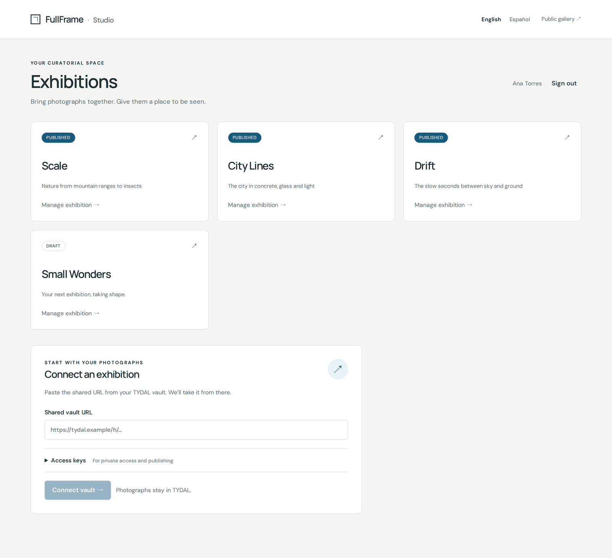

The studio speaks **English or Español**; switch at the top right. This is your
own language, separate from the exhibition's language (below).

## 1 · Connect the exhibition

Each exhibition lives in its own TYDAL vault. Before you start, a TYDAL
administrator prepares it and gives you three things: the vault's **shared
URL**, a **read key** and a **write key** (see
[Setting up in TYDAL](setting-up-in-tydal.md)).

In **Connect an exhibition**:

1. Paste the **shared vault URL**.
2. Open **Access keys** and paste the **read key** and the **write key**.

   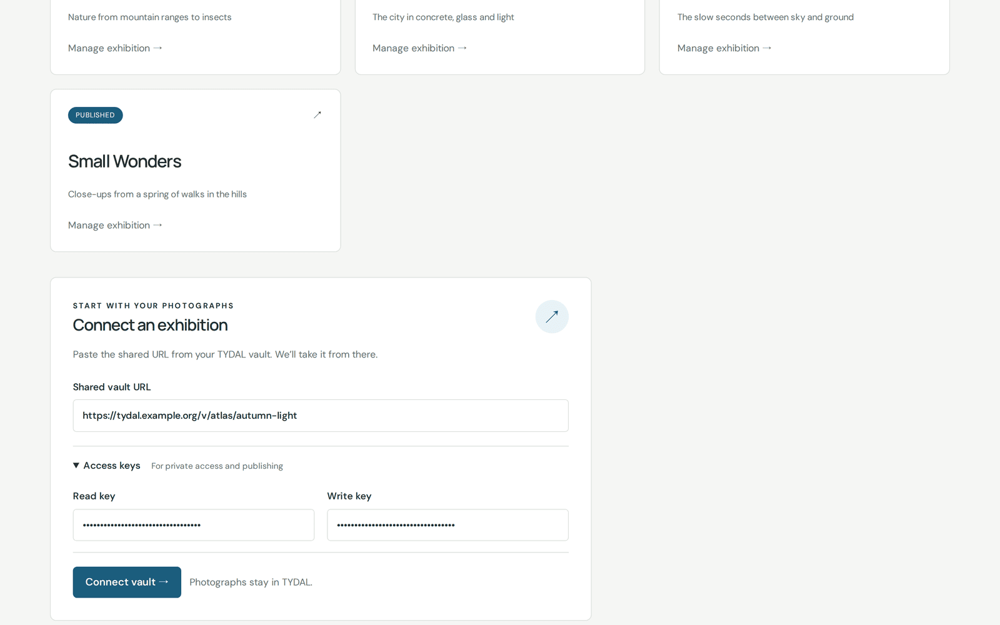

3. Click **Connect vault**. FullFrame checks the vault and shows what it found
   (*Small Wonders · 0 photographs · Private vault*).
4. Give the exhibition its **title** and **language**. The language is the one
   visitors, invited authors and jurors will see FullFrame in, so write your texts
   in it too. You can change it later.
5. **Create exhibition**.

The exhibition opens on its **Setup** page.

## The studio page

Every exhibition has three tabs: **Setup**, **Selection**, and **Appearance &
publish**. Above them, **Preview exhibition** opens the exhibition as visitors
will see it (only you can see it before it opens).

The **Stage** bar says where the exhibition is:

| Stage | Means |
|---|---|
| **Preparing** | You're gathering photographs (and authors, and a jury). Only you and the people you invite can see anything. |
| **Jury scoring** | Jurors are scoring. The photographs are fixed. |
| **Selecting** | Judging is over (or skipped). You choose what to show. |
| **Live** | The exhibition is open to everyone. |

Below the stage, three counters show the number of photographs, whether the
exhibition is private or published, and the jury's size.

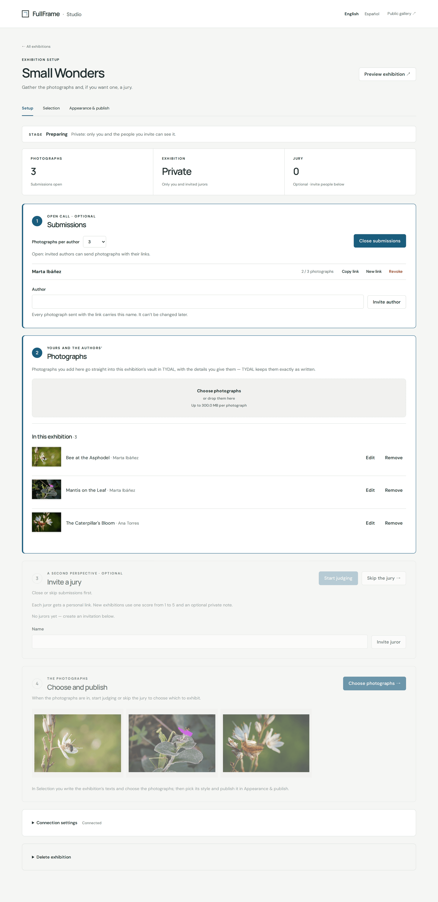

Setup has four numbered boxes, which you work through in order. The ones that
don't apply yet are dimmed but still readable.

## 2 · Gather the photographs

### Open call (optional)

Box **1 · Submissions** invites photographers to send their own work.

1. Choose **Photographs per author**, the most each author may send.
2. Type an author's name and click **Invite author**. Every photograph sent with
   that link carries this name, and it can't be changed later.
3. **Copy link** and send it to the author yourself. FullFrame doesn't send
   emails.
4. When everyone is invited, **Open submissions**.

Each author's row shows how many photographs they've sent
(*2 / 3 photographs*). **New link** replaces an author's link (the old one stops
working); **Revoke** cancels it. When the call is over, **Close submissions**,
or **Skip submissions** if you don't want an open call at all. You can reopen
submissions while you're still preparing.

What authors see is described in [Sending your photographs](authors.md).

### Your own photographs

Box **2 · Photographs** is for adding photographs yourself.

1. Click **Choose photographs** (or drop files on the box).
2. Describe each one. **Title** and **Author** are required; **Technique**
   (e.g. *Silver gelatin print*), **Dimensions** (e.g. *50 × 70 cm*) and
   **Description** are optional, and empty ones simply don't appear in the
   exhibition. The title starts out as the file name, so correct it: it's how
   visitors and jurors will know the photograph.
3. Click **Add 1 photograph** (or *Add 3 photographs*…).

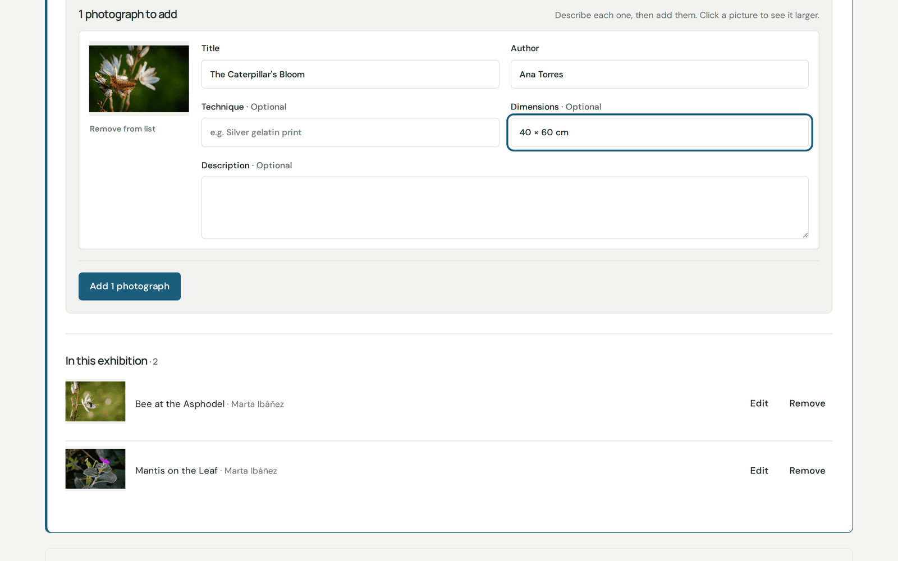

The photographs go straight into the exhibition's vault in TYDAL, exactly as you
wrote them, and appear once TYDAL has prepared their previews.

**In this exhibition** lists every photograph, yours and the authors', with
**Edit** to correct its details and **Remove** to take it out (it goes to TYDAL's
trash, where an administrator can still recover it). Photographs can be added,
edited and removed only while the exhibition is being prepared: once judging
starts, they're fixed.

## 3 · The jury (optional)

Box **3 · Invite a jury** brings in a second perspective.

1. Type a juror's name and click **Invite juror**. Repeat for each juror.
2. **Copy link** and send each juror their personal link.
3. When the photographs are all in (submissions closed or skipped),
   **Start judging**.

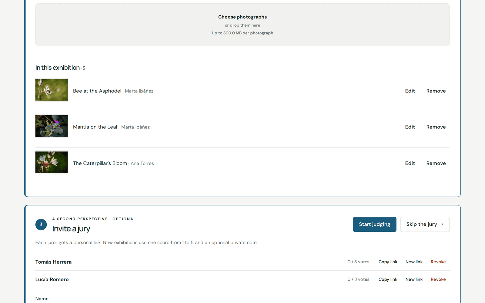

Each juror gives every photograph one score, **Overall impression**, from 1 to
5, and can keep a private note. Their row shows how many votes they've cast. You
can give a juror a **New link** or **Revoke** them at any time.

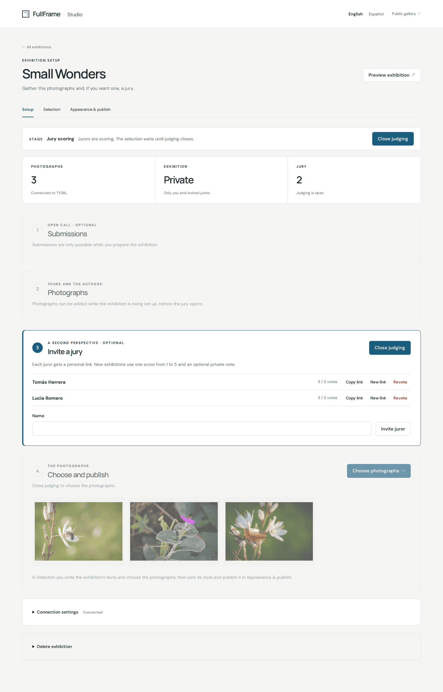

When you're ready, **Close judging**. Scores become read-only, and the exhibition
moves to *Selecting*. You can reopen judging while you're still choosing.

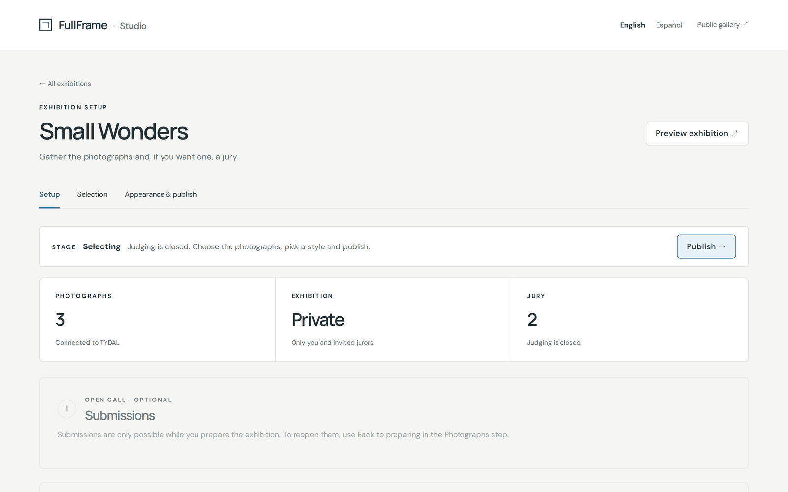

No jury? Click **Skip the jury →** to go straight to selecting. **Back to
preparing** returns to the Preparing stage if you need to add photographs.

What jurors see is described in [Being on a jury](jurors.md).

## 4 · Select

The **Selection** tab has two parts.

**The exhibition**: the public texts.

- **Title** and **Exhibition language**.
- **Introduction**: one sentence that sets the scene, shown under the title.
- **Cover photograph**: the image on the entrance and on the exhibition's
  poster (or *First photograph*).
- **About this exhibition**: the story behind the photographs, shown on the
  About page.

Click **Save details**.

**Choose what to exhibit**: only the photographs you select go into the public
exhibition. Click a photograph to select it (a tick appears), or use **Select
all** / **Clear selection**. If there was a jury, each photograph shows its
average score out of 5 to help you; the choice is always yours. **Save
selection**, then **Next: appearance & publish →**.

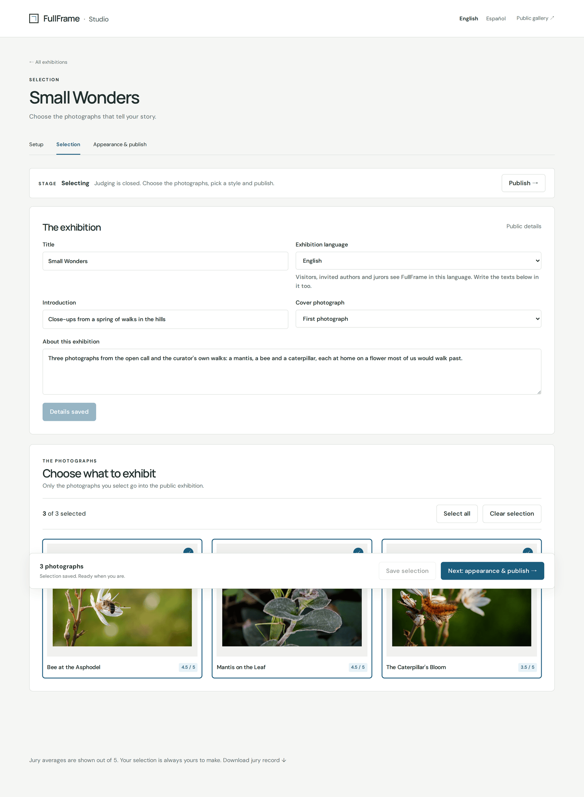

**Download jury record** at the bottom of the page saves every score and note,
as a data file (JSON) for your records or for analysis.

## 5 · Appearance & publish

**Exhibition style** decides how the exhibition looks:

- **Theme**: *White Gallery* (quiet, clean), *Dark Gallery* (a dark room with the
  photographs in focus) or *Editorial* (warm paper, expressive type). None of them
  crops your photographs.
- **Typography**: *Modern* (sans-serif) or *Classic* (serif, with an italic
  collection title).
- **Visitor views**: which of **Mosaic**, **Gallery** and **Wall** visitors may
  open (at least one), and the **Default view** that *Enter the exhibition* leads
  to. See [Visiting an exhibition](visitors.md#ways-of-looking).
- **Gallery layout**: *Flowing rows* or a uniform *Grid*.
- **Palette**: the accent colour, one of *Blue*, *William*, *Plum*, *Graphite*
  and *Copper*.

The **preview** shows your real photographs. Switch between views to compare.
Visitors only see a change once you click **Apply style**.

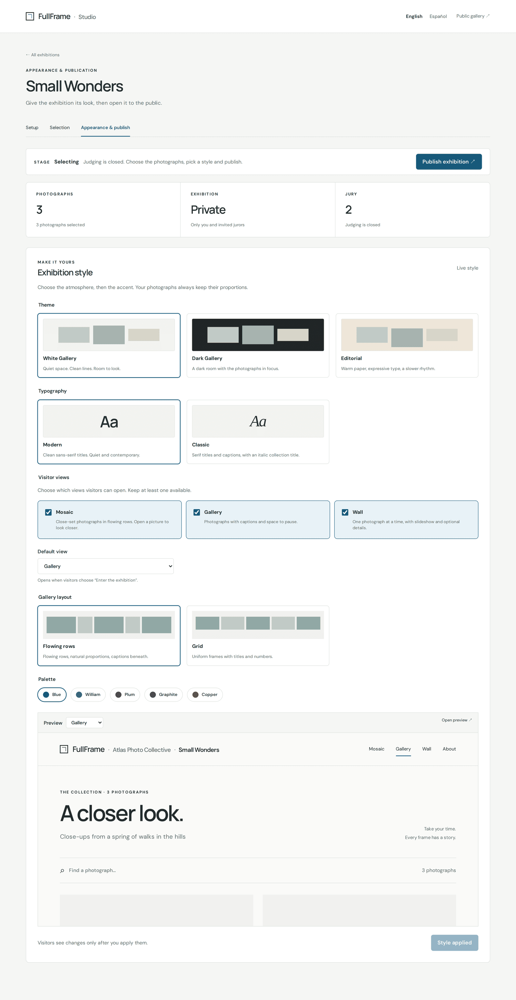

When everything is ready, click **Publish exhibition**. FullFrame asks you to
confirm: the selected photographs become public and jury scoring closes.

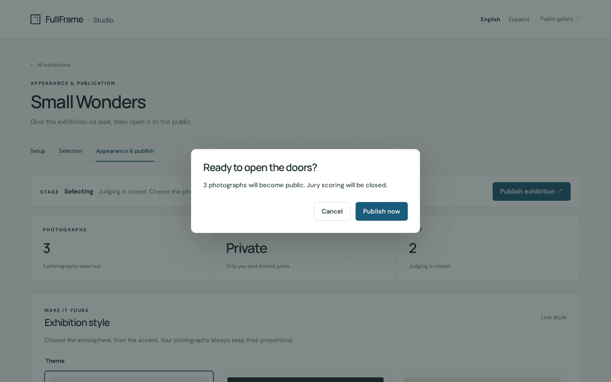

Click **Publish now**. The stage turns **Live**: *Everyone can see it.* **Visit
exhibition** opens it, and it appears on FullFrame's home page.

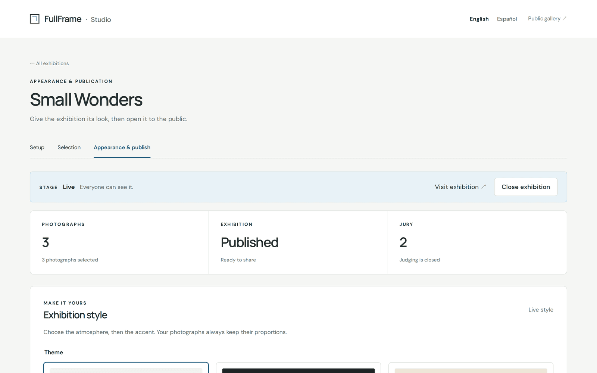

If publishing stops halfway (for example TYDAL accepted the selection but didn't
open it), FullFrame says so and you can simply retry.

## Changing an open exhibition

To revise an exhibition that's live, **Close exhibition** (on the stage bar). The
public exhibition closes and TYDAL makes the vault private again. Change the
selection, texts or style, then publish again. Closing never deletes
photographs or scores.

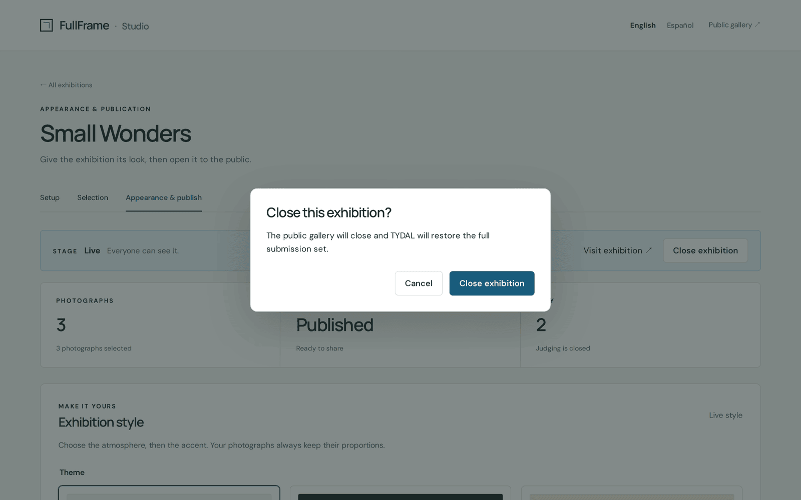

## Connection settings and deleting

At the bottom of Setup:

- **Connection settings** show whether the vault is reachable, and let you
  replace the read or write key (leave a field empty to keep the saved key).
  To move an exhibition to a different vault, create a new exhibition instead,
  so the two jury records don't mix.
- **Delete exhibition** removes the exhibition, its jurors, scores, notes and
  settings from FullFrame. **The photographs in TYDAL are not touched.** To
  confirm, you type the exhibition's address name. An open exhibition must be
  closed first. If TYDAL can't be reached to close it, FullFrame lets you delete
  anyway once you confirm that you'll make the vault private in TYDAL yourself.

Keep a copy of the jury record (**Download jury record**) before deleting an
exhibition that had a jury.

## Messages you may see

- **"Read-only: your TYDAL role lets you look at this exhibition, not change
  it."** Your TYDAL role in this organization is *viewer*. Ask a TYDAL
  administrator to make you an editor.
- **"Add a write key in Connection settings…"** The exhibition was connected
  without a write key, or with one that lacks a permission. Ask your TYDAL
  administrator for a key with the abilities the message lists.
- **"Vault unavailable" / "We couldn't reach the vault."** TYDAL is down or the
  vault was disabled. Retry later, or check Connection settings.

---

← [Visiting an exhibition](visitors.md) · [Contents](README.md) · [Sending your photographs](authors.md) →
