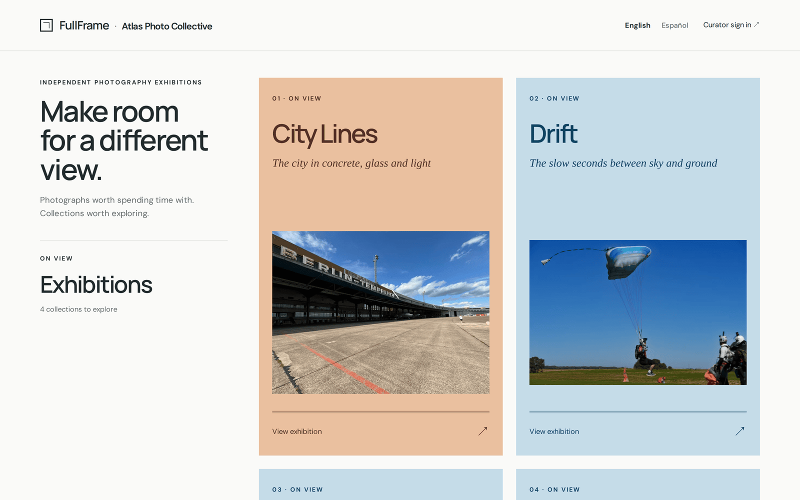
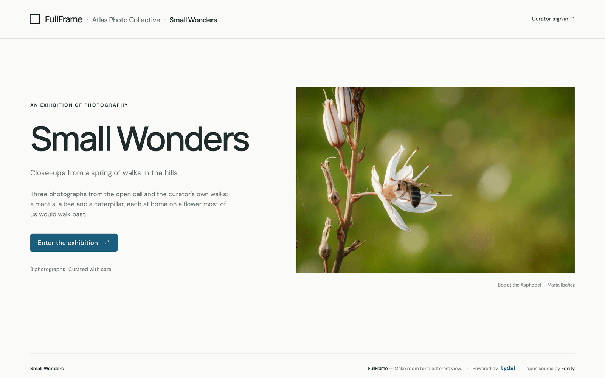
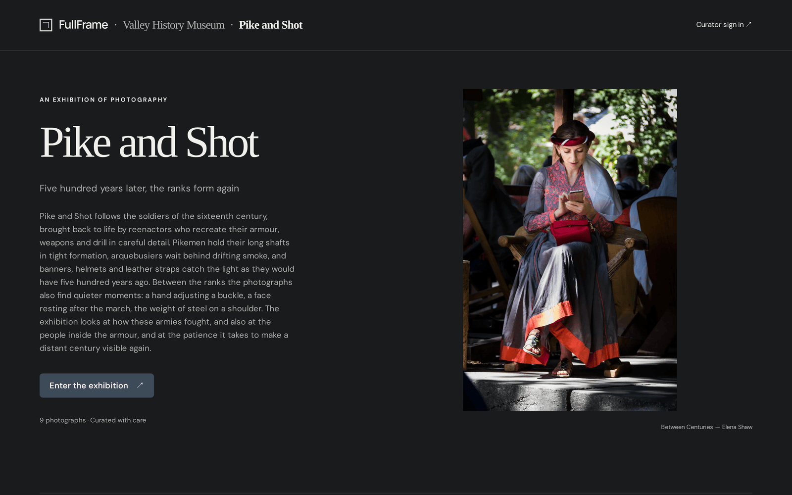
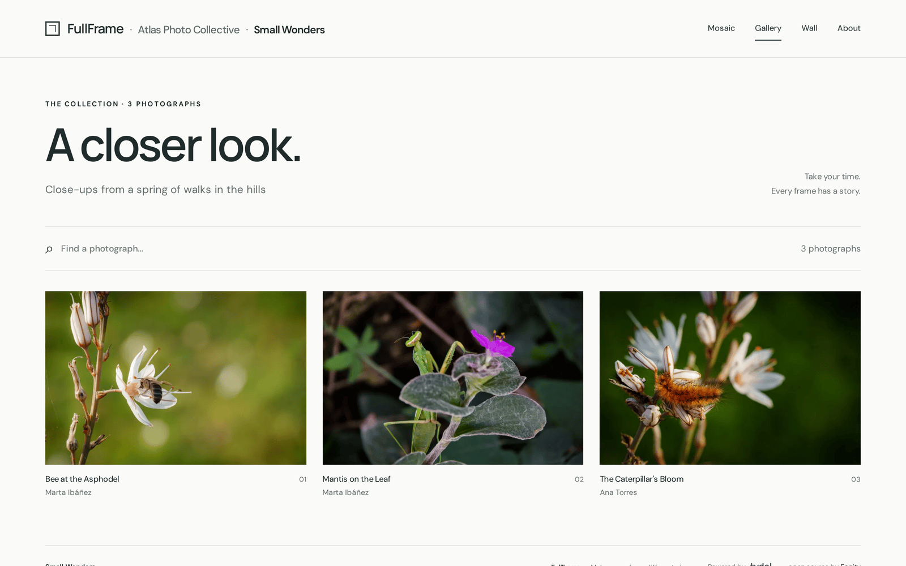
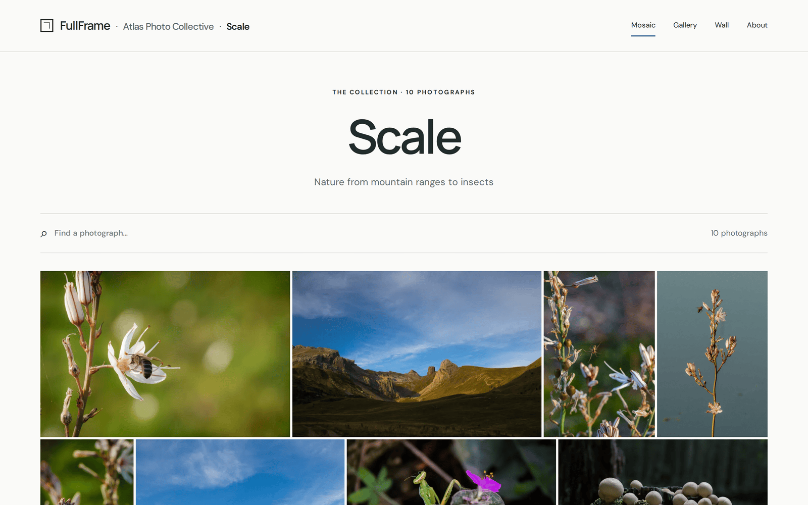
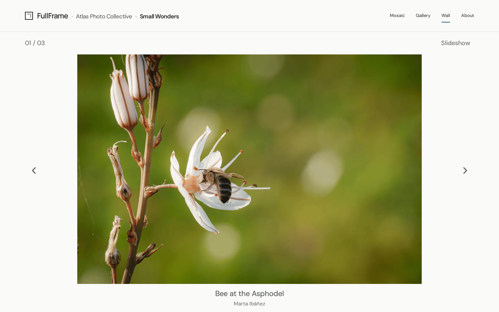
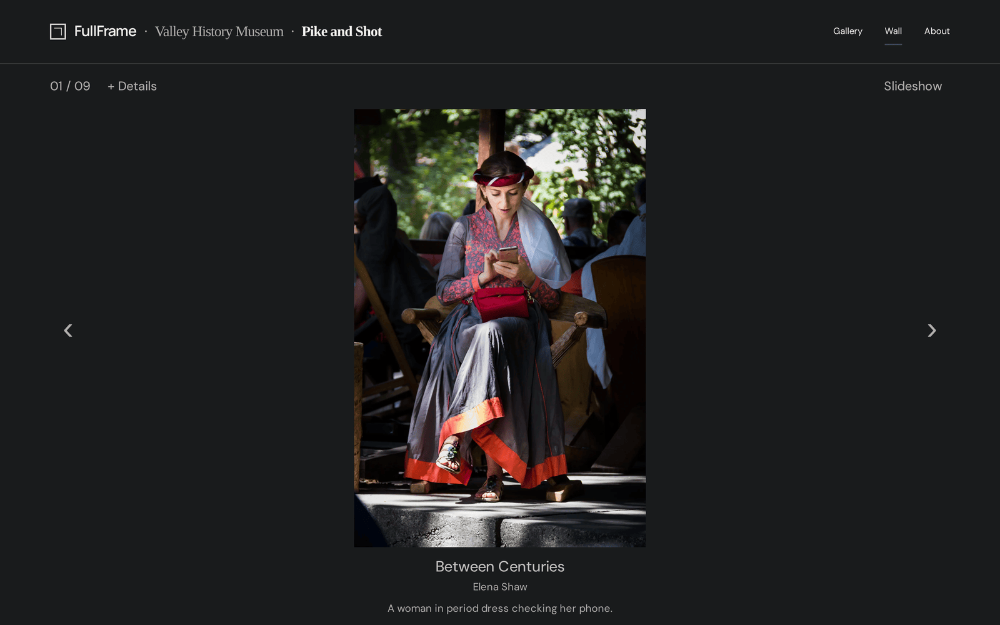
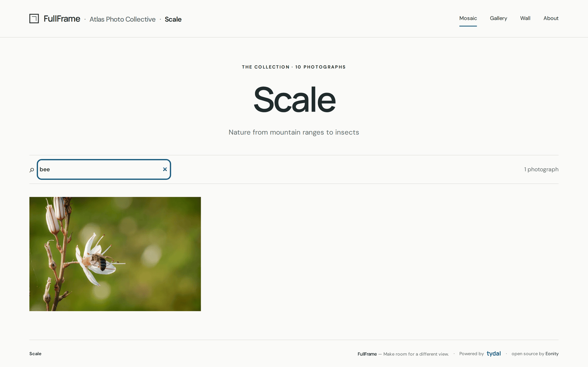

# Visiting an exhibition

[FullFrame user guide](README.md) › Visiting an exhibition

## Finding an exhibition

FullFrame's home page lists the exhibitions **on view**. Each poster shows the
exhibition's title, introduction, organizer and cover photograph. Click
**View exhibition**.

The organizer's name leads to their own page, with only their exhibitions:

**English · Español** at the top switches the site's language.

## The entrance

An exhibition opens on its entrance: the title, the curator's introduction and
the cover. **Enter the exhibition** takes you to the photographs.

Each exhibition has its own look, chosen by its curator: light or dark, modern
or classic typography, a colour accent.

## Ways of looking

The links at the top right switch between the exhibition's **views**. The curator
chooses which are offered, so you may not see all of them.

**Gallery**: photographs with their titles and authors underneath, in rows or as
a grid of cards.

**Mosaic**: the photographs packed closely together, like a photo album. Titles
appear when you point at a photograph.

**Wall**: one photograph at a time, as large as your screen allows.

- Use the arrows on screen, or your keyboard's left and right arrow keys.
- **+ Details** shows the photograph's technique, dimensions and description,
  when the curator has given them.
- **Slideshow** moves on by itself; **Pause** stops it.

Click a photograph in Gallery or Mosaic to see it larger: it opens on the Wall at
that photograph, or in a larger view if the exhibition has no Wall.

**About** tells the story of the exhibition, in the curator's words.

## Searching

In Gallery and Mosaic, **Find a photograph…** filters the photographs as you
type, by title, author, description or tag. The count on the right shows how
many match, and the cross clears the search. When the photographs carry tags, a
**Filters** button next to the search shows them: choose one to see only those
photographs, or **All photographs** to go back.

## Sharing

Every exhibition, view and photograph on the Wall has its own address. Copy it
from your browser to share exactly what you're looking at.

---

← [Contents](README.md) · [Curating an exhibition](curators.md) →
