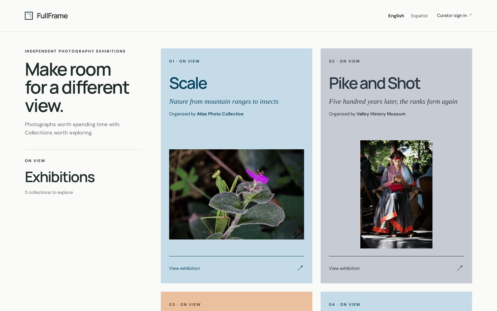

# Guía de uso de FullFrame

*[English](../en/README.md) · Español*

FullFrame convierte un conjunto de fotografías en una exposición en línea. Puedes
reunir las fotografías (las tuyas o las que envíen autores invitados), pedir a un
jurado que las valore si quieres, elegir qué mostrar, darle forma a la exposición
y abrirla al público.

Esta guía es para las personas que usan FullFrame. Cada una ve una parte
distinta:

| Quién | Qué hace | Guía |
|---|---|---|
| **Visitantes** | Recorren las exposiciones abiertas | [Visitar una exposición](visitantes.md) |
| **Comisarios** | Preparan, valoran, seleccionan y publican exposiciones en el **taller** | [Comisariar una exposición](comisarios.md) |
| **Autores invitados** | Envían sus fotografías con un enlace personal | [Enviar tus fotografías](autores.md) |
| **Miembros del jurado** | Valoran las fotografías con un enlace personal | [Formar parte de un jurado](jurado.md) |
| **Administradores** | Preparan el espacio de cada exposición en TYDAL, una vez por exposición | [Preparar una exposición en TYDAL](preparar-en-tydal.md) |

## FullFrame y TYDAL

FullFrame no guarda fotografías. Las fotografías están en **TYDAL**, la
plataforma de recursos que hay detrás, dentro de una **bóveda**: una ventana
protegida a las fotografías de una exposición. FullFrame guarda la exposición en
sí: sus textos y su aspecto, el jurado y sus puntuaciones, los autores invitados
y la selección del comisario.

Esta separación tiene algunas consecuencias prácticas que aparecen a lo largo de
la guía:

- Los comisarios entran en FullFrame **con su cuenta de TYDAL**, y su rol en
  TYDAL decide lo que pueden hacer (los propietarios, administradores y editores
  gestionan exposiciones; los lectores solo pueden mirar).
- Las fotografías que se añaden desde FullFrame van directamente a TYDAL. Si
  quitas una, pasa a la papelera de TYDAL, donde un administrador aún puede
  recuperarla.
- Eliminar una exposición en FullFrame elimina su acta del jurado y sus ajustes,
  nunca las fotografías.

Las capturas de pantalla proceden de una instalación de demostración, con la
interfaz en inglés; en esta guía los botones y mensajes se nombran como aparecen
en español. La exposición que se sigue de principio a fin es *Small Wonders*, de
*Atlas Photo Collective*.

---

[Visitar una exposición](visitantes.md) →
