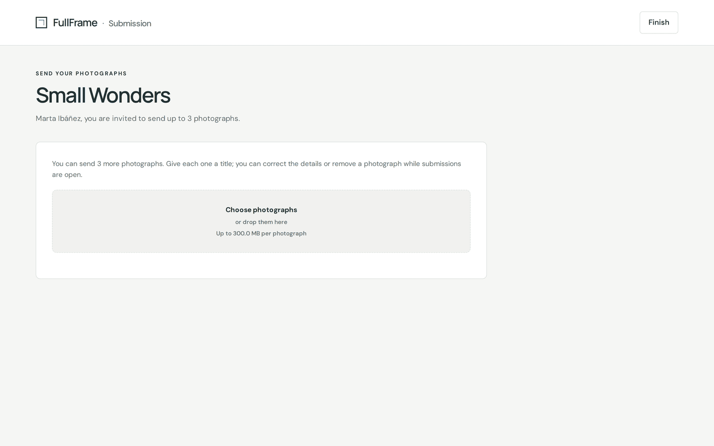
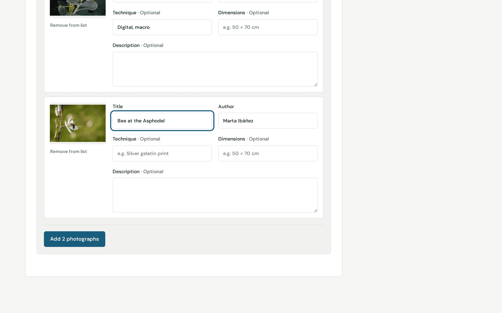
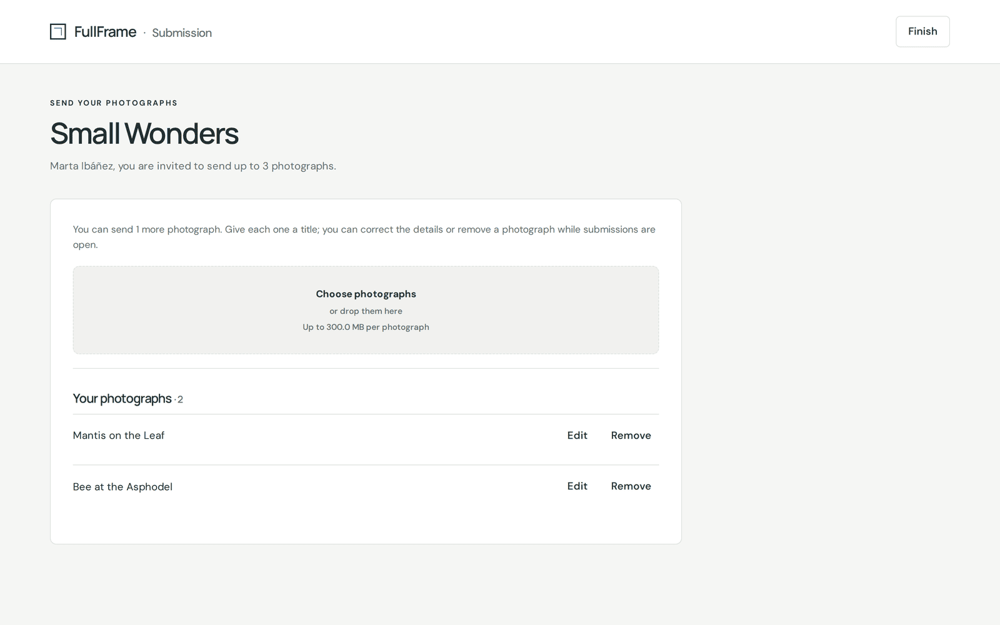
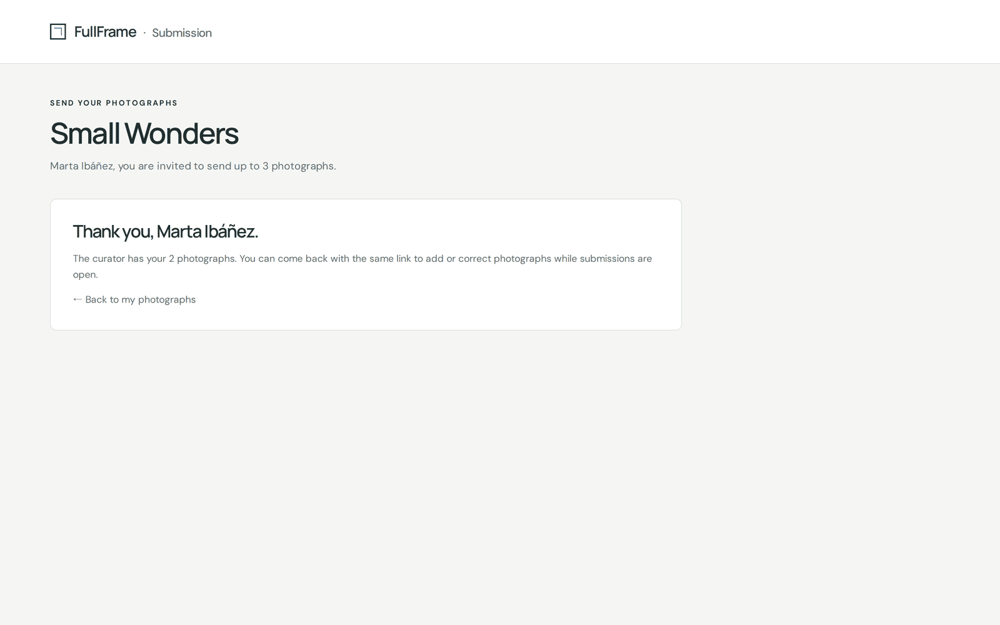

# Enviar tus fotografías

[Guía de uso de FullFrame](README.md) › Enviar tus fotografías

Un comisario te ha invitado a enviar fotografías a una exposición. No necesitas
una cuenta. Todo se hace con el **enlace personal** que te ha enviado el
comisario, así que no lo compartas.

## Abrir tu enlace

La página te saluda por tu nombre e indica cuántas fotografías puedes enviar.

Si indica que la convocatoria está cerrada o aún no se ha abierto, tu enlace
sigue siendo válido: vuelve cuando el comisario la abra.

## Enviar fotografías

1. Haz clic en **Elegir fotografías** (o suelta los archivos en el recuadro). La
   página indica el tamaño máximo de archivo admitido.
2. Ponle un **título** a cada fotografía: es como la conocerán los visitantes y
   el jurado. Tu nombre se rellena a partir de la invitación y no se puede
   cambiar. **Técnica** (p. ej. *copia en gelatina de plata*), **Dimensiones**
   (p. ej. *50 × 70 cm*) y **Descripción** son opcionales.
3. Haz clic en **Añadir 2 fotografías** (el número coincide con las tuyas).

Se envían directamente a la exposición. **Tus fotografías** muestra lo que has
enviado.

## Corregir o retirar

Mientras la convocatoria siga abierta, puedes volver con el mismo enlace y:

- **Editar** los datos de una fotografía;
- **Quitar** una fotografía (lo que deja sitio para enviar otra).

Cuando el comisario cierra la convocatoria, tus fotografías quedan fijadas.

## Terminar

Cuando acabes, haz clic en **Terminar**, arriba a la derecha. Ya puedes cerrar
la página: el comisario tiene tus fotografías.

La página aparece en el idioma de la exposición, elegido por el comisario.

---

← [Comisariar una exposición](comisarios.md) · [Índice](README.md) · [Formar parte de un jurado](jurado.md) →
