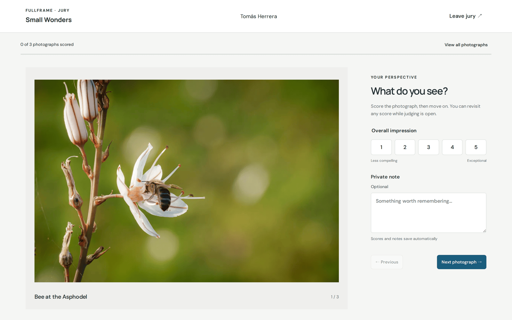
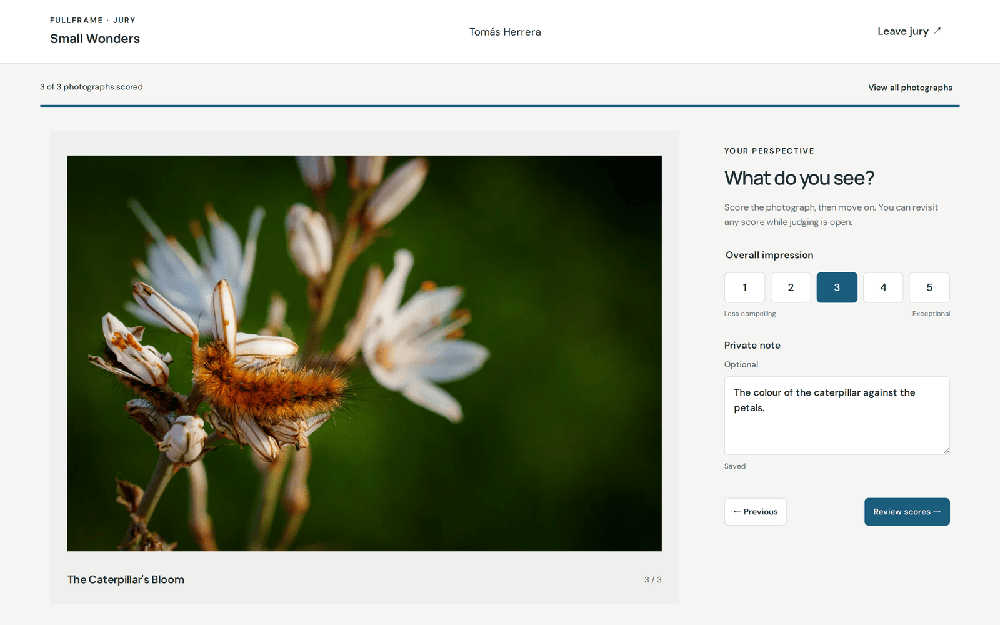
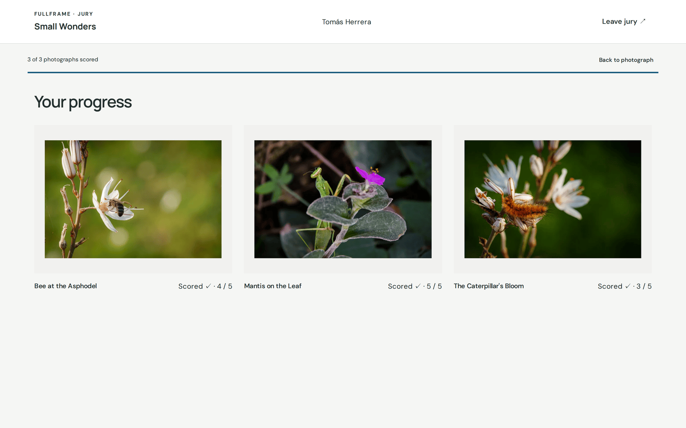

# Formar parte de un jurado

[Guía de uso de FullFrame](README.md) › Formar parte de un jurado

Un comisario te ha pedido que valores las fotografías de una exposición. No
necesitas una cuenta: abre el **enlace personal** que te ha enviado el
comisario. Es solo tuyo, así que no lo compartas.

Si el jurado aún no se ha abierto, la página te lo indica. Tu enlace sigue
siendo válido: vuelve a usarlo más tarde.

## Valorar

La sala del jurado muestra una fotografía cada vez, con su título y su posición
(*1 / 3*).

Para cada fotografía:

1. Elige una puntuación de **Impresión general**, de **1** (*menos sugerente*) a
   **5** (*excepcional*).
2. Si quieres, escribe una **nota privada**: algo que merezca la pena recordar.
   Ni los demás miembros del jurado ni los visitantes la ven nunca. El comisario
   la recibe con el acta del jurado.
3. Haz clic en **Fotografía siguiente →**.

Las puntuaciones y las notas **se guardan automáticamente**. La línea bajo la
nota dice *Guardando…* y después *Guardado*. La barra superior cuenta cuántas
has valorado.

Puedes volver atrás con **← Anterior**, o abrir **Ver todas las fotografías**
para saltar a cualquiera de ellas. La vista general indica cuáles has valorado y
cuáles quedan por valorar.

Puedes cambiar cualquier puntuación mientras el jurado siga abierto. Después de
la última fotografía, **Revisar puntuaciones →** abre la vista general.

## Cuando se cierra el jurado

Cuando el comisario cierra el jurado, tus puntuaciones pasan a ser de solo
lectura y la página te da las gracias. **Salir del jurado**, arriba a la
derecha, cierra tu sesión. Para volver, abre de nuevo tu enlace personal.

La sala del jurado aparece en el idioma de la exposición, elegido por el
comisario.

---

← [Enviar tus fotografías](autores.md) · [Índice](README.md) · [Preparar una exposición en TYDAL](preparar-en-tydal.md) →
